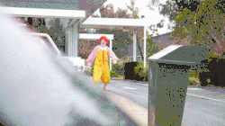

# No, YOU eat the Burger!
2D HTML5 Canvas game where Ronald McDonald and the Burger King force each other to eat their burgers.

## Screenshot

## Why?
We have done multiple "eat the burger" web apps academically, and decided to gamify this exercise in order to explore new technologies and incorporate all we have learned.

## Technologies Used
* HTML5 Canvas
* CSS3
* JavaScript
* Node and Express server
* MongoDB
* React JS
* Piskelapp Sprite sheets
* TexturePacker Atlas sheets
* Sound assets
* Stormpath

## Built with
* Atom and Sublime

## Team Members
* John-Mike Marquardt [Github](https://github.com/codemarq) | [jmmarquardt.com](https://www.jmmarquardt.com)  |  [LinkedIn]()
* Mickey A. Ryan  [Github](https://github.com/MARyan87)  |  [Website](https://michael-ryan-portfolio.herokuapp.com/assignment2/index.html)  |  [LinkedIn](https://www.linkedin.com/in/mickey-ryan-597915a0)
* Ryan Osterman  [Github](https://github.com/ryanosterman10)  |  [Website]()  |  [LinkedIn](https://www.linkedin.com/in/ryanosterman10)
* Matt T. Johnson  [Github](https://github.com/matt-t-johnson)  |  [Website]()  |  [LinkedIn](https://www.linkedin.com/in/matthewtjohnson1)
